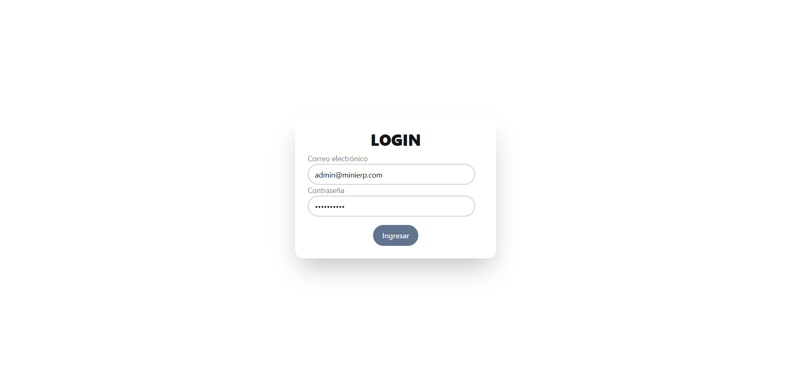
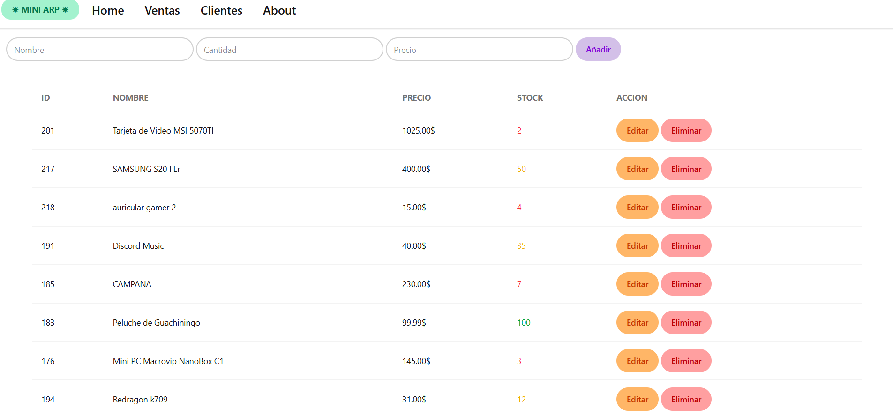

# Mini-ERP

A small front-end web application to manage CRUD operations for professor Raul Netto's [Mini ERP](https://github.com/Piuliss/mini-erp).




## ✨ Features

-   **Authentication:** secure, persistent login with JWT.
-   **CRUD operations for Products:** create, read, update and delete products from the graphical interface.
-   **Add and delete customers:** admins are able to create and delete users.
-   **Sales view:** table for visualizing all sales information.

## 💻 Tech Stack

-   **Frontend Build Tool:** Vite.
-   **Frontend Framework:** React.js.
-   **Styling:** Tailwind CSS.

## 🛠️ Installation and Setup

```bash
git clone https://github.com/OscarLezcano/Proyecto.git
cd Proyecto
npm install
npm run dev
```

## Usage

You can log in with any of these credentials to access the control panel:

| Usuario | Email               | Contraseña | Rol           |
| ------- | ------------------- | ---------- | ------------- |
| admin   | admin@minierp.com   | test123456 | Administrador |
| manager | manager@minierp.com | test123456 | Manager       |
| sales   | sales@minierp.com   | test123456 | Ventas        |

**Note:** you can also check the [API repository](https://github.com/Piuliss/mini-erp).
